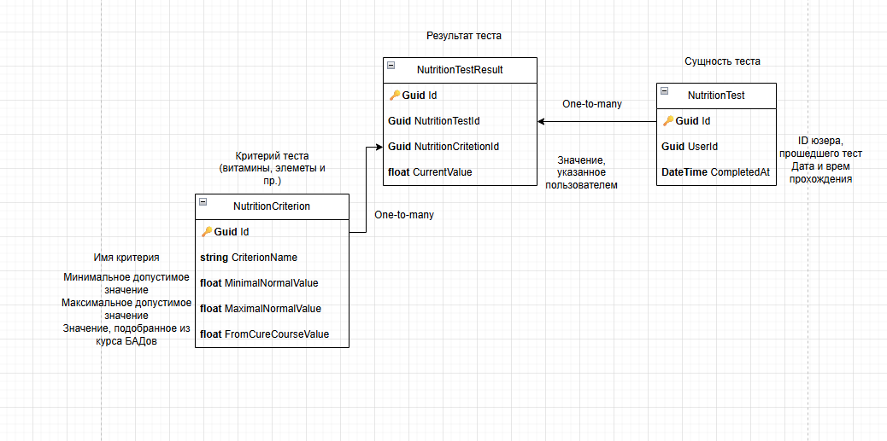

# Тестовое задание для Biogenom

## Использованные инструменты
 - ASP.NET Core Web API
 - EF Core
 - PostgreSQL
 - AutoMapper

## Схема таблиц базы данных



## Структура и функционал решения

Проект состоит из четырёх проектов:
 - `Core` (доменные типы и контракты взаимодействия)
 - `DatabaseAccess` (логика обращения к БД, конфигурации)
 - `Application` (юз-кейсы приложения)
 - `Web` (контроллеры)

 Эндпоинты (для работы удобнее будет создать UUID юзера на любом онлайн-генераторе):
 - GET - `/api/nutrition_tests/{userId}` - получение результатов теста юзера с id `userId`\
Ответ:
```
{
  "id": "3fa85f64-5717-4562-b3fc-2c963f66afa6",
  "userId": "3fa85f64-5717-4562-b3fc-2c963f66afa6",
  "completedAt": "2025-07-13T18:49:00.195Z",
  "results": [
    {
      "id": "3fa85f64-5717-4562-b3fc-2c963f66afa6",
      "nutritionTestId": "3fa85f64-5717-4562-b3fc-2c963f66afa6",
      "nutritionCriterionId": "3fa85f64-5717-4562-b3fc-2c963f66afa6",
      "nutritionCriterion": {
        "id": "3fa85f64-5717-4562-b3fc-2c963f66afa6",
        "criterionName": "string",
        "minimalNormalValue": 0,
        "maximalNormalValue": 0,
        "fromCureCourseValue": 0
      },
      "currentValue": 0,
      "isInDeficit": true,
      "isInExcess": true
    },
    ...
  ]
}
```

 - POST - `/api/nutrition_tests/{userId}` - сохранение результатов теста для `userId`, тело запроса:
 ```
[
  {
    "criterionId": "3fa85f64-5717-4562-b3fc-2c963f66afa6",
    "currentValue": 0
  },
  ...
]
 ```
 где `criterionId` - id критерия, проверяемого в тесте (например, Йод или витамин D), `currentValue` - значение, полученное после обработки ответа пользователя.

 Ответ:
 ```
{
  "message": "Test data saved successfully. Test ID: <test_id>"
}
```
